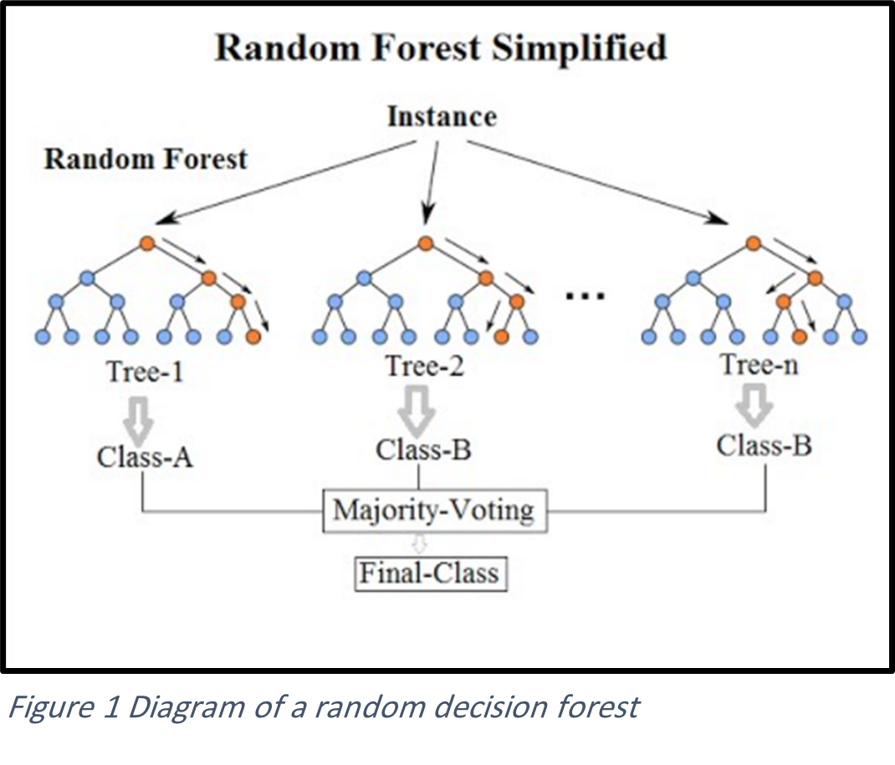
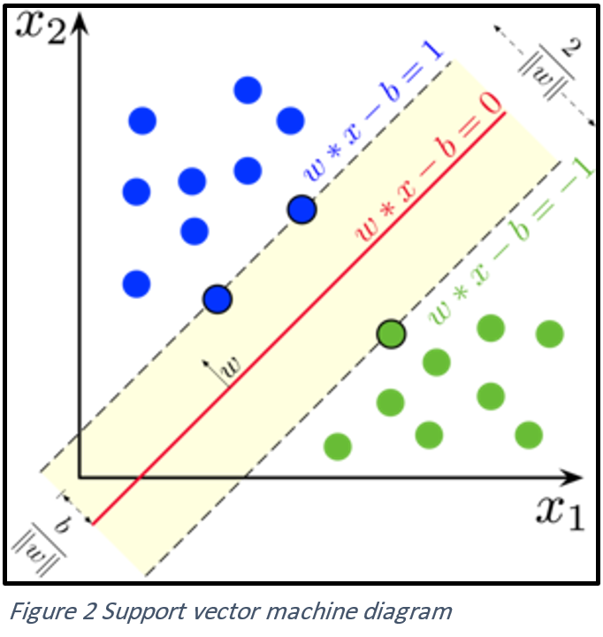
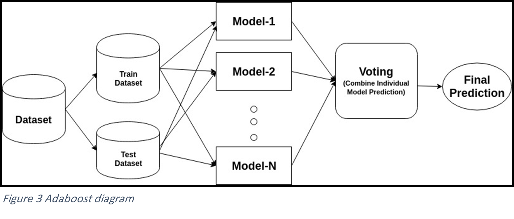
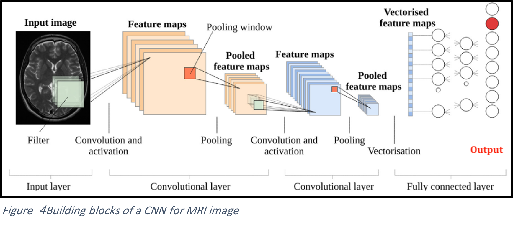

# Brain-MRI-Images-Alzheimer-Classifier

## Introduction:
It is hard for doctors to determine if someone has Alzeheimer diseases or not, either by using images or by text data. Machine learning and deep learning algorithms can be used to solve this problem by classifying the data into different categories.

In this project, we will propose a new model that classify the brain MRI images of the patients using Deep learning. We will also apply Machine learning algorithms based on specific features from the dataset. 
 
## Alzeheimer Classification Model
## Motivation:
The project main function is to detect (classify) AlZehaimar. It includes two parts, which are machine learning (ML) part and deep learning part (DL).
+	ML part: The input data for this part is structured data (.csv file). Multiple ML classification algorithms are applied to it (Such as, random forest, SVM, ... etc).
+	DL part: The input data for this part is brain MRI images. CNN is applied to classify images.

## Methods:
As Mentioned above, there are two parts in this project and for each part there are many applied methods.
### ML part.
+	Random Forest: is a supervised machine learning algorithm which is extremely popular and is used for Classification and Regression problems in Machine Learning. It is consisting of many decisions trees.
	

+	Support vector machine (SVM): is one of the most popular Machine Learning classification algorithms, is a further extension of the Support Vector Classifier (SVC) and Maximal Margin Classifier (MMC) which is used in order to accommodate non-linear class boundaries.
	
 
+	Adaboost: is the most popular versions of boosting. It works on the principle of learners growing sequentially. Except for the first, each subsequent learner is grown from previously grown learners.
 
 
### DL part.
+	Convolutional Neural Network (CNN): was primarily designed for image data. It uses a convolutional operator for extracting data features, allows parameter sharing, is efficient to train, and it has less parameters than NNs with fully connected layers.
 

## Datasets:
In our project we have two different datasets but both of them are under one topic.

1- Alzheimer MRI Preprocessed Dataset:
For our project we used Alzheimer Brain MRI Preprocessed Dataset for the deep learning part, Preprocessed Alzheimer Disease Brain MRI (Magnetic Resonance Imaging). This dataset consists of 4 classes including 6400 MRI images.
+	Class 1: Mild Demented (896 images).
+	Class 2: Moderate Demented (64 images).
+	Class 3: Non-Demented (3200 images).
+	Class 4: Very Mild Demented (2240 images).

The main motive behind sharing this dataset is to design or to develop an accurate framework or architecture for the classification of Alzheimers Disease. It falls (classified) under Computer Science, Classification, Deep Learning, and CNN.

2- MRI and Alzheimers:
For our project we used MRI and Alzheimers Dataset for the machine learning part, Magnetic Resonance Imaging Comparisons of Demented and Nondemented Adults. This dataset consists of 2 classes of 566 subjects.
+	Cross-sectional MRI Data in Young, Middle Aged, Nondemented and Demented Older Adults (416 subjects).
+	Longitudinal MRI Data in Nondemented and Demented Older Adults (150 subjects).

The project aimed at making MRI data sets of the brain freely available to the scientific community. It falls (classified) under Health, Healthcare, and Neuroscience.

 
## Conclusion:
In this project, we applied machine learning and deep learning algorithms on two datasets that are under the subject of Alzheimer. We have gone through many steps to achieve high accuracy models that can be used to solve our identified problem. 

•	Sources:
	https://www.kaggle.com/datasets/jboysen/mri-and-alzheimers?datasetId=1980&sortBy=voteCount&language=Python
	https://www.kaggle.com/datasets/sachinkumar413/alzheimer-mri-dataset
	https://www.kaggle.com/code/psycon/brain-mri-image-alzheimer-classifier
	https://stackabuse.com/implementing-svm-and-kernel-svm-with-pythons-scikit-learn/
	https://machinelearningmastery.com/adaboost-ensemble-in-python/
	https://towardsdatascience.com/understanding-cnn-convolutional-neural-network-69fd626ee7d4#:~:text=CNN%20is%20a%20type%20of,features%20automatically%20for%20better%20classification.
	https://www.simplilearn.com/tutorials/machine-learning-tutorial/random-forest-algorithm#:~:text=A%20Random%20Forest%20Algorithm%20is,more%20it%20will%20be%20robust.
	https://www.analyticsvidhya.com/blog/2021/09/adaboost-algorithm-a-complete-guide-for-beginners/
	https://www.javatpoint.com/machine-learning-support-vector-machine-algorithm

